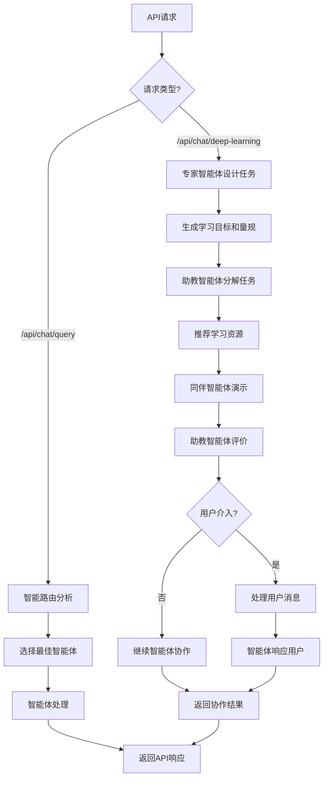

# **"智教魔方"——广东省中小学AI自学辅导助教系统产品需求文档 (PRD)**

## 1. 产品概述

"智教魔方"是一个基于AgentScope框架的无状态多智能体AI教育后端服务系统，专为广东省中小学人工智能教育设计。系统通过专家智能体、助教智能体和同伴智能体的协作，为前端应用提供智能化的AI教育服务接口，支持常规对话模式和深度学习模式两种服务模式。

该系统解决了传统AI教育中缺乏个性化指导、学习过程单调、缺少智能体协作等问题，通过完全无状态的API服务架构，为教育应用开发者提供高效、灵活的AI教学能力。

## 2. 核心功能

### 2.1 服务模式

系统采用完全无状态的服务架构，不需要用户注册和登录，支持两种主要的学习交互模式：

| 模式类型   | 触发方式   | 核心特性                    |
| ------ | ------ | ----------------------- |
| 常规对话模式 | 直接提问   | 基于问题类型智能路由到最佳智能体，单次请求响应 |
| 深度学习模式 | 选择深入学习 | 三智能体协作的结构化学习流程，支持用户随时介入 |

### 2.2 功能模块

"智教魔方"系统包含以下核心功能模块：

1. **智能体服务引擎**：多智能体协作处理、智能路由选择、用户消息处理
2. **深度学习模式服务**：结构化学习流程、任务分解处理、资源推荐服务
3. **个性化学习路径增强**：学习风格识别、认知负荷评估、个性化内容生成
4. **会话管理服务**：学习模式选择、智能体状态管理、上下文处理
5. **API服务接口**：RESTful API、健康检查、系统状态监控

### 2.3 功能详情

| 功能模块     | 子功能    | 功能描述                        |
| -------- | ------ | --------------------------- |
| 智能体服务引擎  | 多智能体协作 | 处理专家、助教、同伴智能体的协作逻辑，支持智能路由选择 |
| 智能体服务引擎  | 消息处理   | 接收用户消息，实时处理并返回智能体响应         |
| 智能体服务引擎  | 介入机制   | 支持用户随时介入当前流程，系统优先处理用户消息     |
| 深度学习模式服务 | 任务设计   | 专家智能体基于《素养框架》制定学习目标和评价量规    |
| 深度学习模式服务 | 任务分解   | 助教智能体将大任务分解为清晰的子步骤，推荐学习资源   |
| 深度学习模式服务 | 演示学习   | 同伴智能体展示思考过程，故意犯错并自我修正       |
| 个性化学习路径增强 | 学习风格识别 | 基于前端传递的学习上下文数据，使用VARK模型进行实时分析 |
| 个性化学习路径增强 | 认知负荷评估 | 根据前端提供的学习行为数据，动态评估认知状态 |
| 个性化学习路径增强 | 个性化内容生成 | 基于请求中的学习风格和认知状态数据生成定制化内容 |
| 会话管理服务   | 模式选择   | 处理学习模式选择逻辑，返回相应的服务响应        |
| 会话管理服务   | 上下文处理   | 处理前端传递的会话上下文信息，无状态响应             |
| API服务接口  | 健康检查   | 系统状态监控、智能体状态查询              |
| API服务接口  | 智能路由   | 基于问题类型分析选择最佳响应智能体           |

## 3. 核心流程

### 3.1 常规对话模式API流程

前端应用通过`/api/chat/query`接口发送用户问题，系统通过智能路由分析问题类型（概念理解、操作指导、示例演示），自动选择最适合的智能体（专家、助教或同伴）进行处理并返回响应。每次API调用都是独立处理，不依赖历史记录。

### 3.2 深度学习模式API流程

前端应用首先调用`/api/chat/session/init`接口初始化会话，系统返回学习模式选择提示。当用户选择深度学习模式后，通过`/api/chat/deep-learning`接口进行交互：专家智能体设计学习任务和评价量规 → 助教智能体分解子任务并推荐资源 → 同伴智能体演示完整学习过程 → 助教智能体评价反馈。用户可随时通过API介入提问，系统优先处理用户消息。

### 3.3 API服务流程图

## 5. 技术实现细节

### 5.1 后端技术架构

**技术栈**：

* API框架：FastAPI + Python 3.8+ + AgentScope v0.1.6

* LLM服务：Kimi API (kimi-k2-0711-preview)

* 机器学习：scikit-learn + pandas + numpy（实时学习风格识别和认知负荷评估）

* 数据处理：Pydantic（结构化数据模型）+ asyncio（异步处理）

* 部署平台：Claudebase

* 架构设计：完全无状态的RESTful API服务，所有个性化数据通过请求参数传递

### 5.2 核心API接口

系统提供14个核心API接口，分为四大类别：

#### 基础服务接口
1. **GET /** - 服务状态检查
2. **GET /api/v1/system/health** - 系统健康检查

#### 智能体对话接口
3. **POST /api/v1/agent/chat** - 单智能体对话交流
4. **POST /api/v1/qa/intelligent** - 智能问答服务

#### 智能群聊管理器接口
5. **POST /api/v1/chat/session/init** - 会话初始化和智能分析
6. **POST /api/v1/chat/collaborate** - 多智能体协作对话
7. **GET /api/v1/chat/session/{session_id}/status** - 获取会话状态信息
8. **POST /api/v1/chat/optimize-path** - 学习路径优化

#### 个性化学习接口
9. **POST /api/v1/content/personalized** - 个性化内容生成
10. **POST /api/v1/learning/path** - 个性化学习路径
11. **POST /api/v1/learning/deep-mode** - 深度学习模式
12. **POST /api/v1/analytics/learning** - 学习数据分析

### 5.3 智能体服务配置

系统包含8个智能体服务：

* **专家智能体服务**：提供概念解释和理论指导

* **助教智能体服务**：提供操作指导和任务分解

* **同伴智能体服务**：提供示例演示和错误展示

* **深度学习专家智能体服务**：提供学习目标设计

* **深度学习助教智能体服务**：提供任务分解和资源推荐

* **深度学习同伴智能体服务**：提供学习过程演示

* **学习风格分析智能体服务**：基于前端传递的学习行为数据，使用VARK模型进行实时分析

* **个性化内容生成智能体服务**：根据请求中包含的学习风格和认知状态数据生成定制内容

### 5.4 服务部署方案

采用Claudebase平台部署后端API服务，支持自动扩缩容和负载均衡，确保API服务高可用性和响应性能。

### 5.2 API服务架构

**服务层次**：

* API网关：FastAPI服务，处理请求路由和响应

* 智能体层：AgentScope框架，管理多智能体协作

* 外部服务：Kimi API，提供LLM能力

* 知识库：RAG检索服务，支持教育内容查询

**无状态设计**：

* 请求独立性：每次API调用独立处理，不依赖历史状态

* 智能体选择：基于请求内容动态路由到最佳智能体

* 水平扩展：支持多实例部署和负载均衡

* 故障恢复：单点故障不影响整体服务可用性

* 会话管理：通过请求参数传递上下文信息

### 5.3 API接口规范

**核心接口**：

#### 基础服务接口
1. `GET /` - 服务状态检查
2. `GET /api/v1/system/health` - 系统健康检查

#### 智能体对话接口
3. `POST /api/v1/agent/chat` - 单智能体对话交流
4. `POST /api/v1/qa/intelligent` - 智能问答服务

#### 智能群聊管理器接口
5. `POST /api/v1/chat/session/init` - 会话初始化和智能分析
6. `POST /api/v1/chat/collaborate` - 多智能体协作对话
7. `GET /api/v1/chat/session/{session_id}/status` - 获取会话状态信息
8. `POST /api/v1/chat/optimize-path` - 学习路径优化

#### 个性化学习接口
9. `POST /api/v1/content/personalized` - 个性化内容生成
10. `POST /api/v1/learning/path` - 个性化学习路径
11. `POST /api/v1/learning/deep-mode` - 深度学习模式
12. `POST /api/v1/analytics/learning` - 学习数据分析

**接口特性**：

* 统一使用JSON格式进行数据交换

* 支持标准HTTP状态码和错误处理

* 包含请求ID用于日志追踪和问题排查

* 响应包含智能体类型、处理时间等元数据

* 完全无状态设计，支持水平扩展

**服务保障**：

* API密钥认证，确保接口访问安全

* 请求频率限制，防止恶意调用

* 输入验证和过滤，确保数据安全

* 错误信息标准化，便于客户端处理

## 6. 系统安全性和服务保障

### 6.1 API安全机制

**接口安全控制**：

* API密钥认证机制，确保接口访问安全

* 请求频率限制，防止恶意调用和系统过载

* 严格的输入参数验证和过滤机制

* HTTPS传输加密，保护数据传输安全

**服务安全保障**：

* 环境变量安全管理API密钥

* 服务健康状态实时监控

* 异常请求检测和防护机制

* 系统资源使用监控和告警

### 6.2 内容安全和隐私保护

**内容安全机制**：

* LLM模型层面的内容安全过滤

* 实时敏感词检测和内容审核

* 教育内容适宜性验证

* 智能体响应质量监控

**隐私保护措施**：

* 无状态设计，不存储用户个人信息

* 最小化数据收集原则

* 符合《个人信息保护法》要求

* 请求数据仅用于当次服务响应

## 7. 性能优化和扩展性

### 7.1 性能优化策略

**响应速度优化**：

* 智能体响应缓存机制

* LLM API调用优化和连接池

* 知识库检索结果缓存

* 异步处理和并发请求管理

**并发处理能力**：

* 使用AgentScope的分布式特性

* FastAPI异步处理能力

* 智能体负载均衡

* 请求队列和限流机制

### 7.2 系统扩展性设计

**水平扩展能力**：

* 无状态服务架构，易于水平扩展

* 容器化部署支持（Docker）

* Claudebase平台弹性扩容

* API网关和负载均衡

**功能扩展性**：

* 插件化的智能体工具系统

* 可配置的知识库和学习内容

* 支持新的LLM模型接入

* 多智能体协作模式扩展

## 8. 测试策略

### 8.1 功能测试

**智能体功能测试**：

* 常规对话模式的智能路由准确性测试

* 深度学习模式的完整工作流程测试

* 用户介入机制的响应准确性测试

* RAG知识检索的准确性和相关性测试

* 三智能体协作的逻辑一致性测试

**API接口测试**：

* 所有API端点的功能完整性测试

* 请求参数验证和错误处理测试

* 响应格式和数据结构验证测试

* 无状态处理的正确性测试

### 8.2 性能测试

**负载测试**：

* 并发请求处理能力测试

* 智能体响应时间性能测试

* LLM API调用性能和稳定性测试

* 系统资源使用情况监控

**安全测试**：

* API输入验证和注入攻击防护测试

* 内容安全过滤机制测试

* HTTPS传输安全测试

* API密钥和环境变量安全测试

## 9. 部署方案

### 9.1 开发环境配置

**本地开发环境**：

* Python 3.8+ 环境配置

* AgentScope v0.1.6 框架安装

* FastAPI开发服务器

* 环境变量配置（MOONSHOT\_API\_KEY）

* AgentScope Studio监控工具（可选）

**开发工具链**：

* Git版本控制和代码协作

* Docker容器化开发环境

* API接口测试工具

* 代码质量检查和安全扫描

### 9.2 生产环境部署

**Claudebase平台部署**：

* FastAPI应用容器化部署

* 环境变量安全配置

* 自动扩容和负载均衡

* 健康检查和服务监控

**部署配置**：

* Docker镜像构建和推送

* 环境变量和密钥管理

* API网关和访问控制

* 日志收集和性能监控

## 10. 项目里程碑和开发计划

### 10.1 第一阶段：核心架构搭建（3周）

**Week 1：环境搭建和基础框架**：

* AgentScope v0.1.6开发环境配置

* FastAPI基础框架搭建

* 环境变量和配置管理

* 基本的API接口框架和健康检查

**Week 2-3：智能体服务核心实现**：

* 专家智能体服务的学习目标设计功能

* 助教智能体服务的任务分解和评价功能

* 同伴智能体服务的演示和错误展示功能

* 智能路由器的实现和测试

### 10.2 第二阶段：功能完善（4周）

**Week 4-5：深度学习模式服务实现**：

* 深度学习模式完整工作流程

* 三智能体协作机制

* 会话初始化和上下文管理

* 结构化输出和数据模型

**Week 6-7：个性化学习功能实现**：

* 学习风格识别系统（VARK模型集成）

* 认知负荷评估算法实现

* 个性化内容生成智能体开发

* 个性化API接口实现和测试

**Week 7-8：API接口完善和集成**：

* 完整API接口实现

* RAG知识库集成

* 常规对话模式API实现

* 错误处理和异常管理机制

### 10.3 第三阶段：测试和部署（3周）

**Week 9-10：API测试和优化**：

* API接口功能完整性测试

* 智能体协作逻辑测试

* 个性化学习功能准确性测试

* 学习风格识别算法验证

* API性能优化和并发处理

* 安全性测试和内容过滤验证

**Week 11：部署和上线**：

* Claudebase平台部署配置

* 环境变量和密钥安全管理

* API监控和日志系统配置

* API文档整理和交付

### 10.4 后续迭代计划

**智能体服务能力增强**：

* 智能体工具包扩展和集成

* 多模态内容支持（图片、文档解析）

* 智能体协作模式优化

**API功能扩展**：

* 批量处理API接口

* 实时流式响应支持

* API使用统计和监控

* 第三方服务集成接口

**系统优化迭代**：

* 知识库内容更新和扩展

* 响应速度和准确性优化

* 多语言和国际化支持

* 企业级部署和定制化服务

## 11. 风险评估和应对策略

### 11.1 技术风险

**智能体响应质量风险**：

* 风险描述：LLM模型可能产生不准确或不合适的教育内容

* 应对策略：建立多层内容过滤机制，定期评估和优化提示词

* 监控指标：响应准确率、内容安全评分、用户反馈质量

**API服务稳定性风险**：

* 风险描述：高并发请求可能导致服务响应缓慢或不可用

* 应对策略：请求限流、异步处理、服务熔断机制

* 监控指标：API响应时间、服务可用性、错误率

### 11.2 服务安全风险

**API安全风险**：

* 风险描述：恶意请求可能导致服务滥用或攻击

* 应对策略：请求频率限制、输入验证、访问控制

* 监控指标：异常请求检测、API调用统计、安全事件日志

**依赖服务风险**：

* 风险描述：外部LLM API服务中断可能影响系统可用性

* 应对策略：多模型备选方案、服务降级机制、监控告警

* 监控指标：外部服务可用性、调用成功率、响应延迟

### 11.3 业务风险

**用户接受度风险**：

* 风险描述：用户可能对AI教学助手的效果存在质疑

* 应对策略：功能演示、用户培训、持续优化体验

* 监控指标：API调用频率、用户反馈评分、功能使用率

**教育内容质量风险**：

* 风险描述：智能体生成的教育内容可能存在准确性问题

* 应对策略：知识库质量控制、专家审核、用户反馈机制

* 监控指标：内容准确性评估、专家评审结果、用户纠错反馈

## 12. 成功指标和评估标准

### 12.1 技术性能指标

**API服务指标**：

* API响应时间 < 3秒（95%请求）

* 服务可用性 > 99.5%

* 并发请求处理能力 > 500 QPS

* API调用成功率 > 99%

**智能体性能指标**：

* 智能体响应准确率 > 85%

* 深度学习模式完成率 > 90%

* 智能路由准确率 > 88%

* 内容安全过滤准确率 > 95%

### 12.2 服务质量指标

**响应质量指标**：

* 用户问题解决率 > 80%

* 内容相关性评分 > 4.0/5.0

* 教育适宜性评分 > 4.2/5.0

* 智能体协作流畅度 > 85%

**系统稳定性指标**：

* 错误率 < 1%

* 服务恢复时间 < 5分钟

* 外部依赖可用性 > 98%

* 监控告警响应时间 < 2分钟

### 12.3 业务效果指标

**使用效果指标**：

* API调用频次持续增长

* 深度学习模式使用率 > 40%

* 用户反馈评分 > 4.0/5.0

* 问题解决效率提升 > 30%

**服务扩展指标**：

* 新功能集成成功率 > 95%

* 知识库更新响应时间 < 24小时

* 多模型切换成功率 > 98%

* 系统扩容响应时间 < 10分钟

***

本PRD将作为"智教魔方"系统开发的核心指导文档，随着项目进展和用户反馈，将持续更新和完善。
