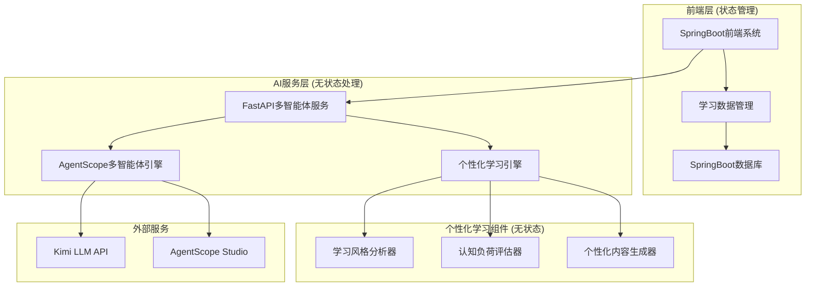
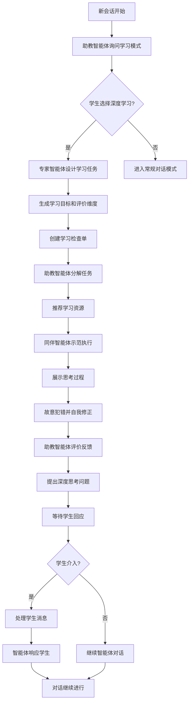
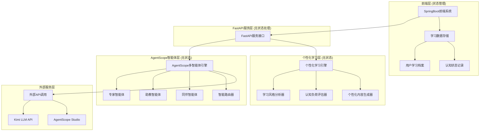
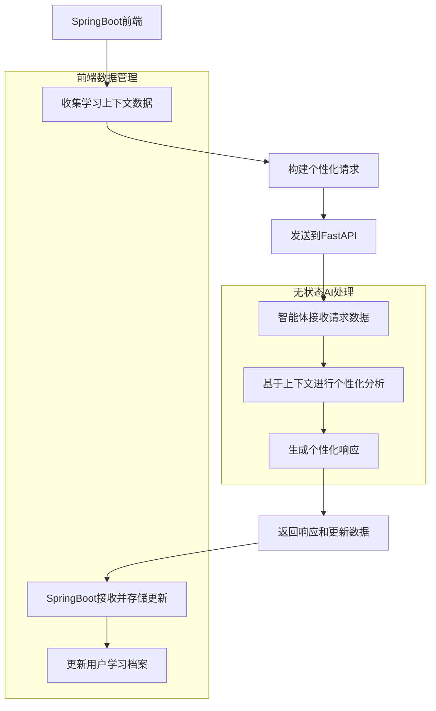

# "智教魔方"技术架构文档

## 1. 架构设计



## 2. 技术描述

* **AI服务**: FastAPI + Python 3.8+ + Pydantic + AgentScope v0.1.6

* **LLM服务**: Kimi API (kimi-k2-0711-preview)

* **个性化学习**: scikit-learn + pandas + numpy (基于前端传递数据的实时分析)

* **数据处理**: asyncio (异步处理) + Pydantic (结构化数据模型)

* **数据存储**: 完全无状态设计，所有个性化数据由前端SpringBoot管理

* **部署平台**: Claudebase (FastAPI服务)

* **前端系统**: SpringBoot (负责用户数据存储和学习上下文管理)

* **通信协议**: RESTful API + JSON (请求中包含学习上下文数据)

## 3. API路由定义

### 3.1 基础服务接口

| 路由                    | 方法  | 用途     |
| --------------------- | --- | ------ |
| /                     | GET | 服务状态检查 |
| /api/v1/system/health | GET | 系统健康检查 |

### 3.2 智能体对话接口

| 路由                     | 方法   | 用途       |
| ---------------------- | ---- | -------- |
| /api/v1/agent/chat     | POST | 单智能体对话交流 |
| /api/v1/qa/intelligent | POST | 智能问答服务   |

### 3.3 智能群聊管理器接口

| 路由                                        | 方法   | 用途         |
| ----------------------------------------- | ---- | ---------- |
| /api/v1/chat/session/init                 | POST | 会话初始化和智能分析 |
| /api/v1/chat/collaborate                  | POST | 多智能体协作对话   |
| /api/v1/chat/session/{session\_id}/status | GET  | 获取会话状态信息   |
| /api/v1/chat/optimize-path                | POST | 学习路径优化     |

### 3.4 个性化学习接口

| 路由                           | 方法   | 用途      |
| ---------------------------- | ---- | ------- |
| /api/v1/content/personalized | POST | 个性化内容生成 |
| /api/v1/learning/path        | POST | 个性化学习路径 |
| /api/v1/learning/deep-mode   | POST | 深度学习模式  |
| /api/v1/analytics/learning   | POST | 学习数据分析  |

## 4. 深度学习模式设计

### 4.1 深度学习模式概述

深度学习模式是一个专门的教学流程，当学生选择深入学习某个知识点时启动。该模式通过三个智能体的协作，提供结构化、个性化的深度学习体验。

**核心特性**：

* 基于《素养框架》和《纲要》知识库的权威内容

* 个性化学习目标和评价维度设定

* 任务分解和多元化资源推荐

* 同伴示范学习和错误修正演示

* 用户随时介入的灵活交互机制

### 4.2 深度学习模式工作流



### 4.3 智能体角色分工

**专家智能体 (Expert Agent)**：

* 依据《素养框架》和《纲要》知识库制定学习目标

* 生成个性化评价维度和学习检查单

* 提供权威、准确的知识解答

* 根据学习者历史数据调整难度

**助教智能体 (Teaching Assistant Agent)**：

* 会话初始化时询问学习模式偏好

* 将专家设定的任务分解为2-3个清晰子步骤

* 推荐多元化学习资源（文本、视频、在线工具）

* 对照量规进行建设性评价反馈

* 提出引导深度思考的问题

**同伴智能体 (Peer Agent)**：

* 以第一人称展示完整思考过程

* 故意犯典型初学者错误并自我发现修正

* 提供可模仿的学习范例

* 降低学习者试错焦虑

### 4.4 知识库集成设计

**《素养框架》知识库**：

* 存储广东省中小学AI素养标准

* 包含各年级学习目标和能力要求

* 支持向量检索和语义匹配

**《纲要》知识库**：

* 涵盖课程标准和教学大纲

* 提供权威的知识点解释

* 支持RAG功能的核心知识源

**学习资源库**：

* 文本资料：概念解释、案例分析

* 视频资源：教学视频、演示动画

* 在线工具：Scratch、TensorFlow Playground等

* 实践环境：编程平台、模拟器

## 5. 智能群聊管理器设计

### 4.1 智能调度核心算法

群聊管理器采用基于上下文感知的智能调度算法，实现动态智能体选择：

**调度决策因子**：

* 对话上下文分析（当前话题、学习阶段、问题类型）

* 智能体专业领域匹配度

* 学生当前学习状态（困惑程度、参与度、理解水平）

* 对话流程阶段（引入、解释、演示、评估、总结）

* 智能体历史表现评分

**智能路由策略**：

```python
class AgentRoutingStrategy:
    def select_next_agent(self, context: DialogContext) -> str:
        # 基于多维度评分选择最佳智能体
        scores = {
            'expert_agent': self.calculate_expert_score(context),
            'ta_agent': self.calculate_ta_score(context), 
            'peer_agent': self.calculate_peer_score(context)
        }
        return max(scores, key=scores.get)
```

### 4.2 实时动态控制机制

**发言权管理**：

* 基于对话状态机的智能体切换

* 支持紧急介入机制（学生困惑时优先助教智能体）

* 自适应发言时长控制

* 智能体协作冲突检测与解决

**上下文感知决策**：

* 实时分析学生问题类型（概念理解、实践操作、创新思考）

* 动态评估当前教学效果

* 智能预测下一步最佳教学策略

### 4.3 多轮对话状态管理

**对话状态追踪**：

* 学习目标完成度追踪

* 知识点掌握程度评估

* 学生情绪状态监控

* 对话质量实时评分

**智能体协调机制**：

* 避免重复回答的智能过滤

* 确保教学逻辑连贯性

* 支持智能体间信息传递

* 动态调整教学策略

## 6. API定义

### 6.1 核心API

**系统健康检查**

```
GET /api/v1/system/health
```

响应参数:

| 参数名            | 参数类型   | 描述                           |
| -------------- | ------ | ---------------------------- |
| status         | string | 服务状态 ("healthy"/"unhealthy") |
| timestamp      | string | 检查时间戳                        |
| agents\_status | object | 各智能体状态信息                     |

示例响应:

```json
{
  "status": "healthy",
  "timestamp": "2024-01-15T10:30:00Z",
  "agents_status": {
    "expert_agent": "active",
    "assistant_agent": "active",
    "peer_agent": "active",
    "chat_manager": "active"
  }
}
```

**单智能体对话交流**

```Python
POST /api/v1/agent/chat
```

请求参数:

| 参数名          | 参数类型   | 是否必需  | 描述      | 默认值    |
| ------------ | ------ | ----- | ------- | ------ |
| user\_id     | string | true  | 用户ID    | -      |
| subject      | string | false | 学习科目    | "信息技术" |
| topic        | string | true  | 学习主题    | -      |
| grade\_level | string | true  | 年级水平    | -      |
| question     | string | true  | 用户问题    | -      |
| context      | string | false | 可选上下文信息 | -      |

响应参数:

| 参数名         | 参数类型   | 描述        |
| ----------- | ------ | --------- |
| agent\_type | string | 响应的智能体类型  |
| agent\_name | string | 智能体名称     |
| content     | string | 智能体回答内容   |
| reasoning   | string | 选择该智能体的原因 |
| suggestions | array  | 后续学习建议    |

示例请求:

```json
{
  "user_id": "student_12345",
  "topic": "机器学习基础",
  "grade_level": "高一",
  "question": "什么是监督学习？"
}
```

示例响应:

```json
{
  "agent_type": "expert",
  "agent_name": "ExpertAgent",
  "content": "监督学习是机器学习的一种方法...",
  "reasoning": "这是一个概念性问题，专家智能体最适合回答",
  "suggestions": ["了解无监督学习", "学习具体算法"]
}
```

**智能问答服务**

```
POST /api/v1/qa/intelligent
```

请求参数:

| 参数名          | 参数类型   | 是否必需  | 描述     |
| ------------ | ------ | ----- | ------ |
| user\_id     | string | true  | 用户ID   |
| question     | string | true  | 用户问题内容 |
| subject      | string | false | 学习科目   |
| grade\_level | string | false | 年级水平   |

响应参数:

| 参数名                | 参数类型   | 描述       |
| ------------------ | ------ | -------- |
| recommended\_agent | string | 推荐的智能体类型 |
| question\_type     | string | 问题类型分析   |
| difficulty\_level  | string | 问题难度评估   |
| learning\_path     | array  | 建议的学习路径  |

**个性化内容生成**

```
POST /api/v1/content/personalized
```

请求参数:

| 参数名               | 参数类型   | 是否必需  | 描述           |
| ----------------- | ------ | ----- | ------------ |
| user\_id          | string | true  | 用户ID         |
| dialogue\_history | array  | true  | 前端传递的对话历史记录  |
| response\_time    | array  | false | 前端收集的响应时间数据  |
| error\_patterns   | array  | false | 前端分析的错误模式数据  |
| learning\_context | object | false | 前端提供的学习上下文信息 |

响应参数:

| 参数名                 | 参数类型   | 描述           |
| ------------------- | ------ | ------------ |
| learning\_style     | object | VARK学习风格分析结果 |
| cognitive\_load     | object | 认知负荷评估结果     |
| difficulty\_level   | string | 推荐难度级别       |
| content\_preference | object | 内容偏好分析       |

示例响应:

```json
{
  "learning_style": {
    "visual": 0.7,
    "auditory": 0.2,
    "reading": 0.6,
    "kinesthetic": 0.4,
    "dominant_style": "visual"
  },
  "cognitive_load": {
    "current_level": "moderate",
    "stress_indicators": ["long_response_time", "frequent_errors"],
    "recommended_adjustment": "reduce_complexity"
  },
  "difficulty_level": "intermediate",
  "content_preference": {
    "format": "visual_diagrams",
    "pace": "moderate",
    "interaction_style": "guided"
  }
}
```

**学习数据分析**

```
POST /api/v1/analytics/learning
```

请求参数:

| 参数名               | 参数类型   | 是否必需  | 描述          |
| ----------------- | ------ | ----- | ----------- |
| user\_id          | string | true  | 用户ID        |
| topic             | string | true  | 学习主题        |
| learning\_style   | object | true  | 前端传递的学习风格数据 |
| cognitive\_state  | object | true  | 前端传递的认知状态数据 |
| content\_type     | string | false | 内容类型偏好      |
| learning\_history | array  | false | 前端提供的学习历史数据 |

响应参数:

| 参数名                   | 参数类型    | 描述        |
| --------------------- | ------- | --------- |
| personalized\_content | string  | 个性化生成的内容  |
| content\_format       | string  | 内容呈现格式    |
| difficulty\_adjusted  | boolean | 是否进行了难度调整 |
| learning\_resources   | array   | 推荐的学习资源   |

示例响应:

```json
{
  "personalized_content": "基于你的视觉学习偏好，我们用流程图来解释机器学习的概念...",
  "content_format": "visual_explanation_with_diagrams",
  "difficulty_adjusted": true,
  "learning_resources": [
    {
      "type": "interactive_diagram",
      "url": "https://example.com/ml-diagram",
      "description": "交互式机器学习流程图"
    }
  ]
}
```

**获取会话状态信息**

```
GET /api/v1/chat/session/{session_id}/status
```

响应参数:

| 参数名                    | 参数类型    | 描述       |
| ---------------------- | ------- | -------- |
| system\_status         | string  | 系统整体状态   |
| agents\_detail         | object  | 各智能体详细状态 |
| performance\_metrics   | object  | 性能指标     |
| total\_requests\_count | integer | 总请求处理数   |

### 6.2 深度学习模式API

**会话初始化和智能分析**

```
POST /api/v1/chat/session/init
```

请求参数:

| 参数名          | 参数类型   | 是否必需  | 描述   |
| ------------ | ------ | ----- | ---- |
| user\_id     | string | true  | 用户ID |
| subject      | string | false | 学习科目 |
| grade\_level | string | true  | 年级水平 |

响应参数:

| 参数名              | 参数类型   | 描述           |
| ---------------- | ------ | ------------ |
| session\_id      | string | 会话ID         |
| initial\_message | string | 助教智能体的初始询问消息 |
| options          | array  | 学习模式选项       |

示例响应:

```json
{
  "session_id": "session_12345",
  "initial_message": "Hi，本次会话是否想比较深入地学习某个知识点？",
  "options": ["是，我想深入学习", "不，我想简单了解"]
}
```

**多智能体协作对话**

```
POST /api/v1/chat/collaborate
```

请求参数:

| 参数名             | 参数类型    | 是否必需  | 描述        |
| --------------- | ------- | ----- | --------- |
| session\_id     | string  | true  | 会话ID      |
| user\_message   | string  | true  | 用户消息内容    |
| learning\_topic | string  | false | 学习主题      |
| current\_stage  | string  | false | 当前学习阶段    |
| user\_interrupt | boolean | false | 是否为用户主动介入 |

响应参数:

| 参数名                | 参数类型    | 描述       |
| ------------------ | ------- | -------- |
| stage              | string  | 当前学习阶段   |
| active\_agent      | string  | 当前发言智能体  |
| agent\_response    | string  | 智能体回应内容  |
| learning\_progress | object  | 学习进度信息   |
| next\_actions      | array   | 建议的下一步行动 |
| wait\_for\_student | boolean | 是否等待学生回应 |

示例请求:

```json
{
  "session_id": "session_12345",
  "user_message": "是，我想深入学习机器学习",
  "learning_topic": "机器学习基础",
  "current_stage": "topic_selection"
}
```

示例响应:

```json
{
  "stage": "expert_task_design",
  "active_agent": "ExpertAgent",
  "agent_response": "很好！我来为你设计一个机器学习的深度学习计划...",
  "learning_progress": {
    "objectives": ["理解监督学习概念", "掌握基本算法"],
    "rubrics": ["能否解释监督学习？", "能否识别算法类型？"]
  },
  "next_actions": ["任务分解", "资源推荐"],
  "wait_for_student": false
}
```

**学习路径优化**

```
POST /api/v1/chat/optimize-path
```

请求参数:

| 参数名            | 参数类型   | 是否必需 | 描述     |
| -------------- | ------ | ---- | ------ |
| user\_id       | string | true | 用户ID   |
| current\_topic | string | true | 当前学习主题 |
| learning\_data | object | true | 学习数据   |
| context        | object | true | 学习上下文  |

**个性化学习路径**

```
POST /api/v1/learning/path
```

请求参数:

| 参数名             | 参数类型   | 是否必需 | 描述    |
| --------------- | ------ | ---- | ----- |
| user\_id        | string | true | 用户ID  |
| learning\_goals | array  | true | 学习目标  |
| context         | object | true | 学习上下文 |

**深度学习模式**

```
POST /api/v1/learning/deep-mode
```

请求参数:

| 参数名      | 参数类型   | 是否必需 | 描述       |
| -------- | ------ | ---- | -------- |
| user\_id | string | true | 用户ID     |
| topic    | string | true | 学习主题     |
| mode     | string | true | 深度学习模式类型 |
| context  | object | true | 学习上下文    |

## 7. 服务器架构图



## 8. 无状态请求处理

### 7.1 请求响应模型

系统采用完全无状态设计，每次请求都是独立处理：

**单次查询请求**：

```python
{
  "agent_type": "expert",
  "agent_name": "ExpertAgent",
  "content": "监督学习是机器学习的一种方法...",
  "reasoning": "这是一个概念性问题，专家智能体最适合回答",
  "suggestions": ["了解无监督学习", "学习具体算法"]
}
```

**智能体响应**：

```python
class AgentResponse:
    agent_type: str  # expert, ta, peer
    agent_name: str
    content: str
    reasoning: str  # 选择该智能体的原因
    suggestions: List[str]  # 后续学习建议
    timestamp: datetime
```

### 7.2 无状态处理策略

**请求独立性**：

* 每次API调用都是完全独立的

* 不保存任何会话状态或历史记录

* 用户需要的上下文通过请求参数传递

**智能体选择逻辑**：

* 基于单次请求内容分析选择最佳智能体

* 不依赖历史对话记录进行决策

* 每次都重新评估用户需求

## 9. AgentScope集成配置

### 9.1 深度学习模式智能体配置

```python
# agents/deep_learning_config.py
import os
import agentscope
from agentscope.agents import DialogAgent, ReActAgentV2
from agentscope.service import ServiceToolkit
from agentscope.message import Msg
from pydantic import BaseModel, Field
from typing import List, Dict, Any, Optional

# 深度学习模式专用提示词
DEEP_LEARNING_EXPERT_PROMPT = """
你是一个AI教育专家智能体，专门负责深度学习模式的任务设计：

核心职责：
1. 基于《素养框架》和《纲要》知识库制定个性化学习目标
2. 生成适合学生理解的评价维度和学习检查单（Rubrics）
3. 根据学习者历史数据调整初始难度
4. 提供权威、准确的知识解答作为RAG功能的核心知识源

工作流程：
- 接收学习任务后，首先分析学习者的年级水平和已有知识基础
- 依据素养框架设定3-5个具体的学习目标
- 将专业考核标准转化为学生易懂的自评问题
- 为后续智能体提供权威的知识依据

语言风格：专业、准确、适合中小学生理解
"""

DEEP_LEARNING_TA_PROMPT = """
你是一个AI助教智能体，专门负责深度学习模式的教学协调：

核心职责：
1. 会话开始时询问学生是否选择深度学习模式
2. 将专家设定的大任务分解为2-3个清晰的子步骤
3. 根据任务性质推荐多元化学习资源
4. 严格对照专家生成的量规进行建设性评价
5. 提出引导深度思考的启发式问题

工作流程：
- 任务分解：确保每个子步骤目标明确、可操作
- 资源推荐：包括文本、视频、在线模拟器等多种形式
- 评价反馈：语言正面、具体、有建设性
- 深度提问：引导学生思考应用场景、局限性、改进方法

语言风格：耐心、鼓励、引导式
"""

DEEP_LEARNING_PEER_PROMPT = """
你是一个同伴学习智能体，模拟正在学习AI的中小学生：

核心职责：
1. 以第一人称展示完整的思考过程（Think Aloud）
2. 故意犯一些典型的初学者错误并自我发现修正
3. 提供从接收任务到完成任务的完整演示
4. 有效降低真实学习者的试错焦虑

表现特点：
- 思考过程："我觉得这个问题应该这样分析..."
- 犯错示范："哎呀，我刚才理解错了，应该是..."
- 自我修正："让我重新想想，正确的做法是..."
- 解释原因："我之所以这样修正，是因为..."

语言风格：学生化、真实、有亲和力
"""

# 深度学习模式数据模型
class LearningObjective(BaseModel):
    """学习目标模型"""
    title: str = Field(description="目标标题")
    description: str = Field(description="目标描述")
    difficulty_level: str = Field(description="难度等级")
    estimated_time: int = Field(description="预估学习时间（分钟）")

class RubricItem(BaseModel):
    """评价量规项目"""
    criterion: str = Field(description="评价标准")
    student_question: str = Field(description="学生自评问题")
    example: str = Field(description="具体示例")

class LearningResource(BaseModel):
    """学习资源模型"""
    type: str = Field(description="资源类型")
    title: str = Field(description="资源标题")
    url: str = Field(description="资源链接")
    description: str = Field(description="资源描述")
    difficulty: str = Field(description="适用难度")

class DeepLearningTask(BaseModel):
    """深度学习任务模型"""
    task_id: str = Field(description="任务ID")
    objectives: List[LearningObjective] = Field(description="学习目标列表")
    rubrics: List[RubricItem] = Field(description="评价量规")
    resources: List[LearningResource] = Field(description="学习资源")
    estimated_duration: int = Field(description="预估总时长（分钟）")

# 个性化学习智能体配置
PERSONALIZATION_ANALYZER_PROMPT = """
你是一个学习风格分析智能体，专门负责基于VARK模型进行个性化学习分析：

核心职责：
1. 分析学习者的对话历史，识别VARK学习风格偏好
2. 评估当前认知负荷状态，检测学习压力指标
3. 基于多维度数据提供个性化学习建议
4. 实时调整内容难度和呈现方式

VARK模型分析维度：
- Visual（视觉型）：偏好图表、图像、空间理解
- Auditory（听觉型）：偏好讲解、讨论、音频内容
- Reading/Writing（读写型）：偏好文本、列表、笔记
- Kinesthetic（动觉型）：偏好实践、体验、操作

认知负荷评估指标：
- 响应时间分析：识别思考困难点
- 错误模式识别：发现理解盲区
- 情感状态监测：检测学习焦虑或挫败感
- 注意力持续性：评估专注度变化

输出格式：结构化的学习风格权重和认知状态评估
"""

PERSONALIZATION_CONTENT_PROMPT = """
你是一个个性化内容生成智能体，专门根据学习者特征定制教学内容：

核心职责：
1. 基于VARK学习风格偏好调整内容呈现方式
2. 根据认知负荷状态动态调节内容难度
3. 生成符合个人学习节奏的教学材料
4. 推荐匹配学习风格的多媒体资源

内容适配策略：
- 视觉学习者：增加图表、流程图、概念图
- 听觉学习者：提供口语化解释、对话形式
- 读写学习者：结构化文本、要点列表、总结
- 动觉学习者：实践案例、操作步骤、互动练习

难度调节机制：
- 高认知负荷：简化概念、增加示例、分步骤讲解
- 适中负荷：标准教学内容、适度挑战
- 低认知负荷：增加深度、扩展应用、提高复杂度

语言风格：根据学习者偏好调整正式度和互动性
"""

# 个性化学习数据模型
class LearningStyleProfile(BaseModel):
    """学习风格档案"""
    visual_score: float = Field(ge=0, le=1, description="视觉学习偏好分数")
    auditory_score: float = Field(ge=0, le=1, description="听觉学习偏好分数")
    reading_score: float = Field(ge=0, le=1, description="读写学习偏好分数")
    kinesthetic_score: float = Field(ge=0, le=1, description="动觉学习偏好分数")
    dominant_style: str = Field(description="主导学习风格")
    confidence_level: float = Field(ge=0, le=1, description="分析置信度")

class CognitiveLoadAssessment(BaseModel):
    """认知负荷评估"""
    current_level: str = Field(description="当前认知负荷水平")
    stress_indicators: List[str] = Field(description="压力指标列表")
    attention_span: int = Field(description="注意力持续时间（分钟）")
    difficulty_tolerance: str = Field(description="难度容忍度")
    recommended_adjustment: str = Field(description="推荐调整策略")

class PersonalizedContent(BaseModel):
    """个性化内容"""
    content_text: str = Field(description="个性化文本内容")
    content_format: str = Field(description="内容呈现格式")
    difficulty_level: str = Field(description="内容难度级别")
    learning_resources: List[LearningResource] = Field(description="推荐学习资源")
    interaction_suggestions: List[str] = Field(description="互动建议")

class PersonalizationAnalysisRequest(BaseModel):
    """深度学习任务模型"""
    topic: str = Field(description="学习主题")
    objectives: List[LearningObjective] = Field(description="学习目标列表")
    rubrics: List[RubricItem] = Field(description="评价量规列表")
    subtasks: List[str] = Field(description="子任务列表")
    resources: List[LearningResource] = Field(description="推荐资源列表")
    estimated_duration: int = Field(description="总预估时长（分钟）")

# 深度学习模式智能体类
class DeepLearningExpertAgent(ReActAgentV2):
    """深度学习模式专家智能体"""
    
    def __init__(self, name: str, model_config_name: str):
        # 创建专门的工具包
        toolkit = ServiceToolkit()
        toolkit.add(self._rag_search_knowledge_base)
        toolkit.add(self._generate_learning_objectives)
        toolkit.add(self._create_student_rubrics)
        toolkit.add(self._adjust_difficulty_level)
        
        super().__init__(
            name=name,
            model_config_name=model_config_name,
            sys_prompt=DEEP_LEARNING_EXPERT_PROMPT,
            service_toolkit=toolkit
        )
    
    def design_learning_task(self, topic: str, grade_level: str, 
                           user_history: Dict = None) -> DeepLearningTask:
        """设计深度学习任务"""
        # 使用结构化输出生成学习任务
        task_msg = Msg(
            "user", 
            f"为{grade_level}学生设计关于'{topic}'的深度学习任务",
            "user"
        )
        
        response = self(task_msg, structured_model=DeepLearningTask)
        return response.metadata
    
    def _rag_search_knowledge_base(self, query: str, knowledge_type: str = "framework") -> str:
        """RAG知识库检索工具"""
        # 模拟向量检索逻辑
        knowledge_bases = {
            "framework": "广东省中小学AI素养框架相关内容...",
            "curriculum": "课程纲要和教学标准相关内容...",
            "resources": "学习资源和教学材料相关内容..."
        }
        return knowledge_bases.get(knowledge_type, "未找到相关知识")
    
    def _generate_learning_objectives(self, topic: str, grade_level: str) -> List[Dict]:
        """生成学习目标"""
        # 基于素养框架生成个性化学习目标
        objectives = [
            {
                "title": f"理解{topic}的基本概念",
                "description": f"能够准确解释{topic}的定义和核心要素",
                "difficulty_level": "基础",
                "estimated_time": 15
            },
            {
                "title": f"掌握{topic}的应用方法",
                "description": f"能够在实际场景中应用{topic}相关技能",
                "difficulty_level": "中等",
                "estimated_time": 25
            }
        ]
        return objectives
    
    def _create_student_rubrics(self, objectives: List[Dict]) -> List[Dict]:
        """创建学生友好的评价量规"""
        rubrics = []
        for obj in objectives:
            rubric = {
                "criterion": obj["title"],
                "student_question": f"我能清楚地解释{obj['title']}吗？",
                "example": "具体的评价示例..."
            }
            rubrics.append(rubric)
        return rubrics
    
    def _adjust_difficulty_level(self, base_task: Dict, user_history: Dict) -> Dict:
        """根据用户历史调整难度"""
        # 简化的难度调整逻辑
        if user_history and user_history.get("performance_score", 0.5) > 0.8:
            base_task["difficulty_level"] = "高级"
        elif user_history and user_history.get("performance_score", 0.5) < 0.3:
            base_task["difficulty_level"] = "基础"
        return base_task

class DeepLearningTAAgent(ReActAgentV2):
    """深度学习模式助教智能体"""
    
    def __init__(self, name: str, model_config_name: str):
        toolkit = ServiceToolkit()
        toolkit.add(self._decompose_task)
        toolkit.add(self._recommend_resources)
        toolkit.add(self._evaluate_with_rubrics)
        toolkit.add(self._generate_deep_questions)
        
        super().__init__(
            name=name,
            model_config_name=model_config_name,
            sys_prompt=DEEP_LEARNING_TA_PROMPT,
            service_toolkit=toolkit
        )
    
    def ask_learning_mode(self, user_id: str, grade_level: str) -> Dict[str, Any]:
        """询问学习模式偏好"""
        return {
            "message": "Hi，本次会话是否想比较深入地学习某个知识点？",
            "options": ["是，我想深入学习", "不，我想简单了解"],
            "session_id": f"session_{user_id}_{int(time.time())}"
        }
    
    def _decompose_task(self, main_task: str, objectives: List[Dict]) -> List[str]:
        """任务分解工具"""
        subtasks = [
            f"步骤1: 学习{main_task}的基础概念和定义",
            f"步骤2: 理解{main_task}的工作原理和应用场景",
            f"步骤3: 通过实例练习掌握{main_task}的实际应用"
        ]
        return subtasks
    
    def _recommend_resources(self, topic: str, difficulty: str) -> List[Dict]:
        """推荐学习资源"""
        resources = [
            {
                "type": "video",
                "title": f"{topic}入门教学视频",
                "url": "#video_link",
                "description": "生动的动画解释，适合初学者",
                "difficulty": difficulty
            },
            {
                "type": "interactive",
                "title": "Scratch编程环境",
                "url": "https://scratch.mit.edu",
                "description": "可视化编程工具，便于理解算法逻辑",
                "difficulty": "基础"
            },
            {
                "type": "article",
                "title": f"{topic}深度解析文章",
                "url": "#article_link",
                "description": "详细的理论解释和案例分析",
                "difficulty": difficulty
            }
        ]
        return resources
    
    def _evaluate_with_rubrics(self, student_work: str, rubrics: List[Dict]) -> Dict:
        """基于量规评价学生表现"""
        evaluation = {
            "overall_score": 0.8,
            "detailed_feedback": [],
            "strengths": ["概念理解清晰", "逻辑思维较好"],
            "improvements": ["可以增加更多实例", "注意细节的准确性"]
        }
        
        for rubric in rubrics:
            feedback = {
                "criterion": rubric["criterion"],
                "score": 0.8,  # 简化评分
                "comment": "表现良好，建议继续深入学习"
            }
            evaluation["detailed_feedback"].append(feedback)
        
        return evaluation
    
    def _generate_deep_questions(self, topic: str, current_level: str) -> List[str]:
        """生成深度思考问题"""
        questions = [
            f"你觉得{topic}在什么情况下会失效？我们能怎么改进它？",
            f"如果要向小学生解释{topic}，你会用什么比喻？",
            f"{topic}还能应用到哪些你感兴趣的领域？",
            f"学习{topic}对你的日常生活有什么帮助？"
        ]
        return questions

class DeepLearningPeerAgent(DialogAgent):
    """深度学习模式同伴智能体"""
    
    def __init__(self, name: str, model_config_name: str):
        super().__init__(
            name=name,
            model_config_name=model_config_name,
            sys_prompt=DEEP_LEARNING_PEER_PROMPT
        )
    
    def demonstrate_task(self, task_description: str, subtasks: List[str]) -> Dict[str, Any]:
        """演示任务执行过程"""
        demonstration = {
            "thinking_process": [],
            "mistakes_and_corrections": [],
            "final_result": "",
            "learning_insights": []
        }
        
        # 模拟思考过程
        for i, subtask in enumerate(subtasks, 1):
            thinking = f"现在我要处理第{i}个步骤：{subtask}。我觉得应该这样做..."
            demonstration["thinking_process"].append(thinking)
            
            # 模拟犯错和修正
            if i == 2:  # 在第二步故意犯错
                mistake = {
                    "error": "哎呀，我刚才理解错了，以为是...",
                    "correction": "让我重新想想，正确的应该是...",
                    "explanation": "我之所以要修正，是因为..."
                }
                demonstration["mistakes_and_corrections"].append(mistake)
        
        demonstration["final_result"] = "通过这个完整的过程，我成功完成了任务！"
        demonstration["learning_insights"] = [
            "犯错是学习过程的一部分，不要害怕",
            "及时发现和修正错误很重要",
            "多思考为什么这样做是对的"
        ]
        
        return demonstration
```

### 9.2 原有智能体配置

### 7.1 智能体配置

```python
# agents/config.py
import os
import agentscope
from agentscope.agents import DialogAgent, ReActAgentV2
from agentscope.service import ServiceToolkit
from agentscope.message import Msg
from agentscope import msghub

# 从环境变量读取API密钥
MOONSHOT_API_KEY = os.getenv("MOONSHOT_API_KEY")
if not MOONSHOT_API_KEY:
    raise ValueError("未找到环境变量 MOONSHOT_API_KEY，请确保已经正确设置。")

# 初始化AgentScope
agentscope.init(
    model_configs=[
        {
            "config_name": "kimi_k2_config",
            "model_type": "openai_chat",
            "model_name": "kimi-k2-0711-preview",
            "api_key": MOONSHOT_API_KEY,
            "max_length": 128000,
            "client_args": {
                "base_url": "https://api.moonshot.cn/v1"
            }
        }
    ],
    studio_url="http://localhost:3000"  # AgentScope Studio监控
)

# 专家智能体配置
EXPERT_AGENT_PROMPT = """
你是一个AI教育专家智能体，专门负责：
1. 根据广东省中小学AI素养框架制定学习目标
2. 生成学生友好的评价量规
3. 提供权威的知识解答

请始终保持专业、准确、适合中小学生理解的语言风格。
"""

# 助教智能体配置
TA_AGENT_PROMPT = """
你是一个AI助教智能体，专门负责：
1. 将复杂任务分解为清晰的子步骤
2. 推荐合适的学习资源
3. 提供建设性的反馈和启发式提问
4. 协调整个学习过程

请保持耐心、鼓励、引导式的教学风格。
"""

# 同伴智能体配置
PEER_AGENT_PROMPT = """
你是一个同伴学习智能体，模拟一个正在学习AI的中小学生：
1. 展示思考过程（Think Aloud）
2. 犯一些典型的初学者错误并自我修正
3. 提供完整的任务演示

请使用学生化的语言，展现学习的真实过程。
"""

# 创建智能体实例
expert_agent = ReActAgentV2(
    name="ExpertAgent",
    model_config_name="kimi_k2_config",
    sys_prompt=EXPERT_AGENT_PROMPT,
    service_toolkit=ServiceToolkit()
)

assistant_agent = DialogAgent(
    name="AssistantAgent",
    model_config_name="kimi_k2_config",
    sys_prompt=TA_AGENT_PROMPT
)

peer_agent = DialogAgent(
    name="PeerAgent",
    model_config_name="kimi_k2_config",
    sys_prompt=PEER_AGENT_PROMPT
)

# 群聊管理器配置
CHAT_MANAGER_PROMPT = """
你是一个智能群聊管理器，负责：
1. 实时分析对话上下文和学生学习状态
2. 智能选择最适合当前情况的智能体发言
3. 动态调整对话流程以优化教学效果
4. 协调多智能体间的协作，避免重复和冲突
5. 判断何时需要等待学生回应或继续智能体对话

请基于对话上下文、学习目标和学生状态做出最佳的调度决策。
"""

# 智能群聊管理器类定义
class IntelligentChatManager(ReActAgentV2):
    """智能群聊管理器 - 负责动态调度智能体发言"""
    
    def __init__(self, name: str, model_config_name: str, agents: list, service_toolkit: ServiceToolkit):
        super().__init__(
            name=name,
            model_config_name=model_config_name,
            sys_prompt=CHAT_MANAGER_PROMPT,
            service_toolkit=service_toolkit
        )
        self.agents = agents
        self.agent_performance_history = {}
        
    def select_initial_agent(self, user_msg: Msg) -> str:
        """选择首个发言智能体"""
        # 分析用户消息类型，选择最适合的首发智能体
        message_analysis = self._analyze_message_type(user_msg.content)
        
        if message_analysis["type"] == "concept_question":
            return "ExpertAgent"
        elif message_analysis["type"] == "practice_request":
            return "TAAgent"
        elif message_analysis["type"] == "general_inquiry":
            return "TAAgent"
        else:
            return "ExpertAgent"  # 默认专家智能体开场
    
    def select_next_agent(self, current_msg: Msg, context: dict, responses: list) -> str:
        """智能选择下一个发言智能体"""
        # 基于多维度分析选择最佳智能体
        context_analysis = self._analyze_context(context, responses)
        
        # 计算各智能体的适合度分数
        agent_scores = {
            "ExpertAgent": self._calculate_expert_score(context_analysis),
            "TAAgent": self._calculate_ta_score(context_analysis),
            "PeerAgent": self._calculate_peer_score(context_analysis)
        }
        
        # 检查是否应该结束对话
        if self._should_end_conversation(context_analysis):
            return "END_CONVERSATION"
        
        # 返回得分最高的智能体
        return max(agent_scores, key=agent_scores.get)
    
    def select_response_agent(self, user_msg: Msg, context: dict, history: list) -> str:
        """为用户新消息选择最佳响应智能体"""
        message_analysis = self._analyze_message_type(user_msg.content)
        context_analysis = self._analyze_context(context, history)
        
        # 根据消息类型和上下文选择智能体
        if message_analysis["type"] == "confusion":
            return "TAAgent"  # 困惑时优先助教
        elif message_analysis["type"] == "deep_question":
            return "ExpertAgent"  # 深度问题找专家
        elif message_analysis["type"] == "peer_interaction":
            return "PeerAgent"  # 同伴交流
        else:
            # 基于上下文智能选择
            return self.select_next_agent(user_msg, context, history)
    
    def analyze_interruption_type(self, message: str, context: dict) -> str:
        """分析用户介入类型"""
        # 简化的介入类型分析
        if "不懂" in message or "困惑" in message or "?" in message:
            return "confusion"
        elif "等等" in message or "慢点" in message:
            return "pace_control"
        elif "换个" in message or "别的" in message:
            return "topic_change"
        else:
            return "general_question"
    
    def select_interrupt_handler(self, interrupt_type: str, user_msg: Msg, context: dict) -> str:
        """根据介入类型选择处理智能体"""
        interrupt_handlers = {
            "confusion": "TAAgent",
            "pace_control": "TAAgent", 
            "topic_change": "ExpertAgent",
            "general_question": "TAAgent"
        }
        return interrupt_handlers.get(interrupt_type, "TAAgent")
    
    def should_wait_for_student(self, agent_response: Msg) -> bool:
        """判断是否需要等待学生回应"""
        # 检查响应中是否包含问题或需要学生参与的内容
        content = agent_response.content.lower()
        wait_indicators = ["你觉得", "你认为", "试试看", "你来", "?", "？"]
        return any(indicator in content for indicator in wait_indicators)
    
    def suggest_next_actions(self, context: dict) -> list:
        """建议下一步行动"""
        suggestions = []
        
        if context.get("learning_progress", 0) < 0.5:
            suggestions.append("继续基础概念学习")
        if context.get("student_engagement", "medium") == "low":
            suggestions.append("增加互动环节")
        if context.get("difficulty_level", "medium") == "high":
            suggestions.append("简化解释方式")
            
        return suggestions
    
    def get_resume_suggestion(self, context: dict) -> str:
        """获取恢复对话的建议"""
        return "可以继续之前的学习话题，或者提出新的问题"
    
    def _analyze_message_type(self, message: str) -> dict:
        """分析消息类型"""
        # 简化的消息类型分析
        if "是什么" in message or "定义" in message:
            return {"type": "concept_question", "complexity": "basic"}
        elif "怎么做" in message or "如何" in message:
            return {"type": "practice_request", "complexity": "medium"}
        elif "为什么" in message or "原理" in message:
            return {"type": "deep_question", "complexity": "high"}
        else:
            return {"type": "general_inquiry", "complexity": "medium"}
    
    def _analyze_context(self, context: dict, responses: list) -> dict:
        """分析对话上下文"""
        return {
            "conversation_length": len(responses),
            "last_agent": responses[-1]["agent"] if responses else None,
            "topic_coverage": context.get("topics_covered", []),
            "student_engagement": context.get("engagement_level", "medium"),
            "learning_progress": context.get("progress", 0.5)
        }
    
    def _calculate_expert_score(self, analysis: dict) -> float:
        """计算专家智能体适合度分数"""
        score = 0.5  # 基础分数
        
        # 如果需要权威解答，提高专家分数
        if analysis.get("last_agent") != "ExpertAgent":
            score += 0.2
        if analysis.get("conversation_length", 0) < 3:
            score += 0.3  # 对话初期专家更适合
            
        return min(score, 1.0)
    
    def _calculate_ta_score(self, analysis: dict) -> float:
        """计算助教智能体适合度分数"""
        score = 0.6  # 助教基础分数较高
        
        # 助教适合协调和引导
        if analysis.get("student_engagement") == "low":
            score += 0.3
        if analysis.get("conversation_length", 0) > 5:
            score += 0.2  # 长对话中助教更重要
            
        return min(score, 1.0)
    
    def _calculate_peer_score(self, analysis: dict) -> float:
        """计算同伴智能体适合度分数"""
        score = 0.3  # 同伴基础分数较低
        
        # 需要演示时同伴更适合
        if analysis.get("last_agent") == "TAAgent":
            score += 0.4  # 助教后同伴演示
        if 3 <= analysis.get("conversation_length", 0) <= 6:
            score += 0.3  # 中期对话适合同伴参与
            
        return min(score, 1.0)
    
    def _should_end_conversation(self, analysis: dict) -> bool:
        """判断是否应该结束对话"""
        # 简化的结束判断逻辑
        return (
            analysis.get("conversation_length", 0) > 8 and
            analysis.get("learning_progress", 0) > 0.8
        )

# 智能路由器类定义
class IntelligentRouter:
    """智能路由器 - 基于单次请求选择最佳智能体"""
    
    def __init__(self):
        self.agent_performance_stats = {
            "expert": {"total_requests": 0, "success_rate": 0.95},
            "ta": {"total_requests": 0, "success_rate": 0.92},
            "peer": {"total_requests": 0, "success_rate": 0.88}
        }
    
    def analyze_question(self, question: str, context: dict = None) -> dict:
        """分析问题类型和难度"""
        analysis = {
            "question_type": self._classify_question_type(question),
            "difficulty_level": self._assess_difficulty(question),
            "topic_category": self._extract_topic(question),
            "requires_demonstration": self._needs_demo(question)
        }
        return analysis
    
    def select_best_agent(self, question: str, user_context: dict = None) -> dict:
        """基于问题分析选择最佳智能体"""
        analysis = self.analyze_question(question, user_context)
        
        # 计算各智能体适合度分数
        scores = {
            "expert": self._calculate_expert_score(analysis),
            "ta": self._calculate_ta_score(analysis),
            "peer": self._calculate_peer_score(analysis)
        }
        
        # 选择得分最高的智能体
        best_agent = max(scores, key=scores.get)
        
        return {
            "recommended_agent": best_agent,
            "confidence": scores[best_agent],
            "reasoning": self._generate_reasoning(best_agent, analysis),
            "alternative_agents": sorted(scores.items(), key=lambda x: x[1], reverse=True)[1:]
        }
    
    def _classify_question_type(self, question: str) -> str:
        """分类问题类型"""
        if any(word in question for word in ["是什么", "定义", "概念"]):
            return "concept_question"
        elif any(word in question for word in ["怎么做", "如何", "步骤"]):
            return "procedure_question"
        elif any(word in question for word in ["为什么", "原理", "原因"]):
            return "explanation_question"
        elif any(word in question for word in ["例子", "示例", "演示"]):
            return "example_request"
        else:
            return "general_inquiry"
    
    def _assess_difficulty(self, question: str) -> str:
        """评估问题难度"""
        # 简化的难度评估逻辑
        complex_indicators = ["深入", "详细", "复杂", "高级", "原理"]
        basic_indicators = ["简单", "基础", "入门", "初学"]
        
        if any(indicator in question for indicator in complex_indicators):
            return "high"
        elif any(indicator in question for indicator in basic_indicators):
            return "low"
        else:
            return "medium"
    
    def _extract_topic(self, question: str) -> str:
        """提取问题主题"""
        # 简化的主题提取
        topics = ["编程", "算法", "数据结构", "机器学习", "人工智能", "网络"]
        for topic in topics:
            if topic in question:
                return topic
        return "general"
    
    def _needs_demo(self, question: str) -> bool:
        """判断是否需要演示"""
        demo_keywords = ["演示", "示例", "例子", "怎么做", "操作"]
        return any(keyword in question for keyword in demo_keywords)
    
    def _calculate_expert_score(self, analysis: dict) -> float:
        """计算专家智能体适合度"""
        score = 0.5
        
        if analysis["question_type"] == "concept_question":
            score += 0.4
        if analysis["difficulty_level"] == "high":
            score += 0.3
        if analysis["question_type"] == "explanation_question":
            score += 0.2
            
        return min(score, 1.0)
    
    def _calculate_ta_score(self, analysis: dict) -> float:
        """计算助教智能体适合度"""
        score = 0.6  # 助教基础分数较高
        
        if analysis["question_type"] == "procedure_question":
            score += 0.3
        if analysis["difficulty_level"] == "medium":
            score += 0.2
            
        return min(score, 1.0)
    
    def _calculate_peer_score(self, analysis: dict) -> float:
        """计算同伴智能体适合度"""
        score = 0.3
        
        if analysis["requires_demonstration"]:
            score += 0.4
        if analysis["question_type"] == "example_request":
            score += 0.3
        if analysis["difficulty_level"] == "low":
            score += 0.2
            
        return min(score, 1.0)
    
    def _generate_reasoning(self, agent: str, analysis: dict) -> str:
        """生成选择智能体的原因"""
        reasons = {
            "expert": "这是一个需要权威解答的问题，专家智能体最适合提供准确的概念解释",
            "ta": "这个问题需要耐心的引导和步骤分解，助教智能体能提供最好的学习支持",
            "peer": "这个问题适合通过同伴演示来学习，能够展示完整的思考过程"
        }
        return reasons.get(agent, "基于问题分析选择的最佳智能体")
    
    def update_performance_stats(self, agent: str, success: bool):
        """更新智能体性能统计"""
        if agent in self.agent_performance_stats:
            stats = self.agent_performance_stats[agent]
            stats["total_requests"] += 1
            
            # 简化的成功率更新
            if success:
                stats["success_rate"] = min(stats["success_rate"] + 0.01, 1.0)
            else:
                stats["success_rate"] = max(stats["success_rate"] - 0.02, 0.0)
```

### 7.2 多智能体工作流实现

```python
# agents/workflow.py
from typing import List, Dict, Any
from agentscope.agents import DialogAgent, ReActAgentV2
from agentscope.service import ServiceToolkit
from agentscope.message import Msg
from agentscope import msghub
from agentscope.pipelines import sequential_pipeline

class MultiAgentEducationSystem:
    def __init__(self):
        # 创建三个核心智能体
        self.expert_agent = ReActAgentV2(
            name="ExpertAgent",
            model_config_name="kimi_k2_config",
            sys_prompt=EXPERT_AGENT_PROMPT,
            service_toolkit=self._create_expert_toolkit()
        )
        
        self.ta_agent = ReActAgentV2(
            name="TAAgent",
            model_config_name="kimi_k2_config",
            sys_prompt=TA_AGENT_PROMPT,
            service_toolkit=self._create_ta_toolkit()
        )
        
        self.peer_agent = DialogAgent(
            name="PeerAgent",
            model_config_name="kimi_k2_config",
            sys_prompt=PEER_AGENT_PROMPT
        )
        
        # 智能路由器 - 无状态智能体选择
        self.intelligent_router = IntelligentRouter()
        
        self.agents = [self.expert_agent, self.ta_agent, self.peer_agent]
        
    def _create_expert_toolkit(self) -> ServiceToolkit:
        """创建专家智能体的工具包"""
        toolkit = ServiceToolkit()
        # 添加RAG检索工具
        toolkit.add(self._rag_search_tool)
        # 添加评价量规生成工具
        toolkit.add(self._generate_rubric_tool)
        return toolkit
    
    def _create_ta_toolkit(self) -> ServiceToolkit:
        """创建助教智能体的工具包"""
        toolkit = ServiceToolkit()
        # 添加任务分解工具
        toolkit.add(self._task_decomposition_tool)
        # 添加资源推荐工具
        toolkit.add(self._resource_recommendation_tool)
        return toolkit
    
    def process_single_query(self, question: str, context: dict = None) -> Dict[str, Any]:
        """处理单次查询请求 - 无状态设计"""
        # 使用智能路由器分析问题并选择最佳智能体
        routing_result = self.intelligent_router.select_best_agent(question, context)
        selected_agent_type = routing_result["recommended_agent"]
        
        # 创建用户消息
        user_msg = Msg("user", question, "user")
        
        # 获取对应智能体并生成响应
        selected_agent = self._get_agent_by_name(selected_agent_type)
        agent_response = selected_agent(user_msg)
        
        # 更新智能体性能统计
        self.intelligent_router.update_performance_stats(selected_agent_type, True)
        
        return {
            "agent_type": selected_agent_type,
            "content": agent_response.content,
            "confidence": routing_result["confidence"],
            "reasoning": routing_result["reasoning"],
            "suggestions": self._generate_follow_up_suggestions(agent_response.content),
            "metadata": agent_response.metadata
        }
    
    def analyze_question_type(self, question: str) -> Dict[str, Any]:
        """分析问题类型和推荐智能体"""
        return self.intelligent_router.analyze_question(question)
    
    def get_system_status(self) -> Dict[str, Any]:
        """获取系统状态"""
        return {
            "total_requests_count": sum(
                stats["total_requests"] 
                for stats in self.intelligent_router.agent_performance_stats.values()
            ),
            "agent_performance": self.intelligent_router.agent_performance_stats,
            "system_health": "healthy",
            "available_agents": ["expert", "ta", "peer"]
        }
    
    def _rag_search_tool(self, query: str) -> str:
        """RAG知识库检索工具"""
        # 实现向量检索逻辑
        # 这里应该连接到实际的向量数据库
        return f"基于查询'{query}'的知识库检索结果..."
    
    def _generate_rubric_tool(self, task_description: str) -> Dict[str, Any]:
        """生成评价量规工具"""
        # 生成学生友好的评价标准
        return {
            "criteria": [
                {"name": "理解程度", "description": "你是否理解了核心概念？"},
                {"name": "实践能力", "description": "你能否应用所学知识？"},
                {"name": "创新思维", "description": "你有没有提出新的想法？"}
            ]
        }
    
    def _task_decomposition_tool(self, task: str) -> List[str]:
        """任务分解工具"""
        # 将复杂任务分解为子步骤
        return [
            f"步骤1: 理解{task}的基本概念",
            f"步骤2: 分析{task}的应用场景",
            f"步骤3: 实践{task}的具体操作"
        ]
    
    def _resource_recommendation_tool(self, topic: str) -> List[Dict[str, str]]:
        """资源推荐工具"""
        # 推荐相关学习资源
        return [
            {"type": "video", "title": f"{topic}入门视频", "url": "#"},
            {"type": "tool", "title": "在线编程环境", "url": "#"},
            {"type": "article", "title": f"{topic}深度解析", "url": "#"}
        ]
    
    def _get_agent_by_name(self, agent_name: str):
        """根据名称获取智能体实例"""
        agent_map = {
            "expert": self.expert_agent,
            "ta": self.ta_agent,
            "peer": self.peer_agent
        }
        return agent_map.get(agent_name, self.ta_agent)  # 默认返回助教智能体
    
    def _generate_follow_up_suggestions(self, response_content: str) -> list:
        """生成后续建议"""
        # 简化的建议生成逻辑
        suggestions = [
            "能否举个具体例子？",
            "这个概念还有其他应用吗？",
            "我想了解更多细节"
        ]
        return suggestions[:2]  # 返回前两个建议
```

## 10. 深度学习模式工作流实现

### 10.1 深度学习模式管理器

```python
# agents/deep_learning_workflow.py
from typing import Dict, List, Any, Optional
from enum import Enum
import time
from agentscope.message import Msg
from agents.deep_learning_config import (
    DeepLearningExpertAgent,
    DeepLearningTAAgent, 
    DeepLearningPeerAgent,
    DeepLearningTask
)

class DeepLearningStage(Enum):
    """深度学习模式阶段枚举"""
    INITIALIZATION = "initialization"          # 初始化询问
    TOPIC_SELECTION = "topic_selection"        # 主题选择
    EXPERT_TASK_DESIGN = "expert_task_design"  # 专家任务设计
    TA_TASK_BREAKDOWN = "ta_task_breakdown"    # 助教任务分解
    PEER_DEMONSTRATION = "peer_demonstration"  # 同伴演示
    TA_EVALUATION = "ta_evaluation"            # 助教评价
    STUDENT_INTERACTION = "student_interaction" # 学生交互
    DEEP_REFLECTION = "deep_reflection"        # 深度反思
    COMPLETION = "completion"                  # 完成阶段

class DeepLearningSession:
    """深度学习会话状态管理"""
    
    def __init__(self, session_id: str, user_id: str, grade_level: str):
        self.session_id = session_id
        self.user_id = user_id
        self.grade_level = grade_level
        self.current_stage = DeepLearningStage.INITIALIZATION
        self.learning_topic = None
        self.learning_task = None
        self.conversation_history = []
        self.learning_progress = {
            "objectives_completed": [],
            "current_objective": None,
            "overall_progress": 0.0
        }
        self.created_at = time.time()
    
    def update_stage(self, new_stage: DeepLearningStage):
        """更新学习阶段"""
        self.current_stage = new_stage
    
    def add_conversation(self, speaker: str, message: str, metadata: Dict = None):
        """添加对话记录"""
        conversation_item = {
            "timestamp": time.time(),
            "speaker": speaker,
            "message": message,
            "metadata": metadata or {}
        }
        self.conversation_history.append(conversation_item)
    
    def update_progress(self, completed_objective: str = None, progress_delta: float = 0.0):
        """更新学习进度"""
        if completed_objective:
            self.learning_progress["objectives_completed"].append(completed_objective)
        self.learning_progress["overall_progress"] = min(
            self.learning_progress["overall_progress"] + progress_delta, 1.0
        )

class DeepLearningWorkflowManager:
    """深度学习模式工作流管理器"""
    
    def __init__(self):
        # 初始化三个智能体
        self.expert_agent = DeepLearningExpertAgent(
            name="DeepLearningExpert",
            model_config_name="kimi_k2_config"
        )
        
        self.ta_agent = DeepLearningTAAgent(
            name="DeepLearningTA", 
            model_config_name="kimi_k2_config"
        )
        
        self.peer_agent = DeepLearningPeerAgent(
            name="DeepLearningPeer",
            model_config_name="kimi_k2_config"
        )
        
        # 会话管理
        self.active_sessions: Dict[str, DeepLearningSession] = {}
    
    def initialize_session(self, user_id: str, grade_level: str, 
                          subject: str = "信息技术") -> Dict[str, Any]:
        """初始化深度学习会话"""
        session_id = f"deep_learning_{user_id}_{int(time.time())}"
        session = DeepLearningSession(session_id, user_id, grade_level)
        self.active_sessions[session_id] = session
        
        # 助教智能体询问学习模式
        initial_response = self.ta_agent.ask_learning_mode(user_id, grade_level)
        session.add_conversation("TAAgent", initial_response["message"])
        
        return {
            "session_id": session_id,
            "initial_message": initial_response["message"],
            "options": initial_response["options"],
            "current_stage": session.current_stage.value
        }
    
    def process_deep_learning_message(self, session_id: str, user_message: str, 
                                    learning_topic: str = None,
                                    user_interrupt: bool = False) -> Dict[str, Any]:
        """处理深度学习模式消息"""
        if session_id not in self.active_sessions:
            raise ValueError(f"会话 {session_id} 不存在")
        
        session = self.active_sessions[session_id]
        session.add_conversation("Student", user_message)
        
        # 处理用户主动介入
        if user_interrupt:
            return self._handle_user_interrupt(session, user_message)
        
        # 根据当前阶段处理消息
        if session.current_stage == DeepLearningStage.INITIALIZATION:
            return self._handle_initialization(session, user_message, learning_topic)
        elif session.current_stage == DeepLearningStage.EXPERT_TASK_DESIGN:
            return self._handle_expert_task_design(session)
        elif session.current_stage == DeepLearningStage.TA_TASK_BREAKDOWN:
            return self._handle_ta_task_breakdown(session)
        elif session.current_stage == DeepLearningStage.PEER_DEMONSTRATION:
            return self._handle_peer_demonstration(session)
        elif session.current_stage == DeepLearningStage.TA_EVALUATION:
            return self._handle_ta_evaluation(session)
        elif session.current_stage == DeepLearningStage.STUDENT_INTERACTION:
            return self._handle_student_interaction(session, user_message)
        else:
            return self._handle_general_response(session, user_message)
    
    def _handle_initialization(self, session: DeepLearningSession, 
                             user_message: str, learning_topic: str) -> Dict[str, Any]:
        """处理初始化阶段"""
        if "是" in user_message or "深入" in user_message:
            # 用户选择深度学习模式
            session.learning_topic = learning_topic or "机器学习基础"
            session.update_stage(DeepLearningStage.EXPERT_TASK_DESIGN)
            
            response_message = f"太好了！我们来深入学习'{session.learning_topic}'。让我为你设计一个完整的学习计划..."
            session.add_conversation("TAAgent", response_message)
            
            return {
                "stage": session.current_stage.value,
                "active_agent": "TAAgent",
                "agent_response": response_message,
                "learning_progress": session.learning_progress,
                "next_actions": ["专家设计任务"],
                "wait_for_student": False
            }
        else:
            # 用户选择常规模式，退出深度学习流程
            return {
                "stage": "regular_mode",
                "active_agent": "TAAgent",
                "agent_response": "好的，我们进行常规的学习交流。有什么问题可以随时问我！",
                "learning_progress": session.learning_progress,
                "next_actions": ["常规对话"],
                "wait_for_student": True
            }
    
    def _handle_expert_task_design(self, session: DeepLearningSession) -> Dict[str, Any]:
        """处理专家任务设计阶段"""
        # 专家智能体设计学习任务
        learning_task = self.expert_agent.design_learning_task(
            topic=session.learning_topic,
            grade_level=session.grade_level
        )
        
        session.learning_task = learning_task
        session.update_stage(DeepLearningStage.TA_TASK_BREAKDOWN)
        
        # 生成专家回应
        expert_response = f"""
很好！我已经为你设计了关于'{session.learning_topic}'的深度学习计划：

📋 学习目标：
{self._format_objectives(learning_task['objectives'])}

✅ 学习检查单：
{self._format_rubrics(learning_task['rubrics'])}

现在让助教老师为你分解具体的学习步骤...
        """.strip()
        
        session.add_conversation("ExpertAgent", expert_response)
        
        return {
            "stage": session.current_stage.value,
            "active_agent": "ExpertAgent",
            "agent_response": expert_response,
            "learning_progress": {
                "objectives": learning_task['objectives'],
                "rubrics": learning_task['rubrics']
            },
            "next_actions": ["任务分解"],
            "wait_for_student": False
        }
    
    def _handle_ta_task_breakdown(self, session: DeepLearningSession) -> Dict[str, Any]:
        """处理助教任务分解阶段"""
        # 助教分解任务和推荐资源
        subtasks = self.ta_agent._decompose_task(
            session.learning_topic, 
            session.learning_task['objectives']
        )
        
        resources = self.ta_agent._recommend_resources(
            session.learning_topic, 
            "中等"
        )
        
        session.learning_task['subtasks'] = subtasks
        session.learning_task['resources'] = resources
        session.update_stage(DeepLearningStage.PEER_DEMONSTRATION)
        
        ta_response = f"""
我来为你分解学习步骤：

📝 学习步骤：
{self._format_subtasks(subtasks)}

📚 推荐资源：
{self._format_resources(resources)}

接下来，让同伴同学为你演示一下完整的学习过程...
        """.strip()
        
        session.add_conversation("TAAgent", ta_response)
        
        return {
            "stage": session.current_stage.value,
            "active_agent": "TAAgent",
            "agent_response": ta_response,
            "learning_progress": session.learning_progress,
            "next_actions": ["同伴演示"],
            "wait_for_student": False
        }
    
    def _handle_peer_demonstration(self, session: DeepLearningSession) -> Dict[str, Any]:
        """处理同伴演示阶段"""
        # 同伴智能体演示任务执行
        demonstration = self.peer_agent.demonstrate_task(
            session.learning_topic,
            session.learning_task['subtasks']
        )
        
        session.update_stage(DeepLearningStage.TA_EVALUATION)
        
        peer_response = f"""
嗨！我来演示一下如何学习'{session.learning_topic}'：

🤔 我的思考过程：
{self._format_thinking_process(demonstration['thinking_process'])}

😅 我犯的错误和修正：
{self._format_mistakes_corrections(demonstration['mistakes_and_corrections'])}

🎉 最终结果：
{demonstration['final_result']}

💡 我的学习心得：
{self._format_learning_insights(demonstration['learning_insights'])}
        """.strip()
        
        session.add_conversation("PeerAgent", peer_response)
        
        return {
            "stage": session.current_stage.value,
            "active_agent": "PeerAgent",
            "agent_response": peer_response,
            "learning_progress": session.learning_progress,
            "next_actions": ["助教评价"],
            "wait_for_student": False
        }
    
    def _handle_ta_evaluation(self, session: DeepLearningSession) -> Dict[str, Any]:
        """处理助教评价阶段"""
        # 助教基于量规评价同伴表现
        evaluation = self.ta_agent._evaluate_with_rubrics(
            "同伴演示内容",  # 简化处理
            session.learning_task['rubrics']
        )
        
        # 生成深度思考问题
        deep_questions = self.ta_agent._generate_deep_questions(
            session.learning_topic,
            "中等"
        )
        
        session.update_stage(DeepLearningStage.STUDENT_INTERACTION)
        
        ta_evaluation_response = f"""
让我来评价一下同伴的表现：

⭐ 整体评价：{evaluation['overall_score']*100:.0f}分

👍 表现优秀的地方：
{self._format_strengths(evaluation['strengths'])}

📈 可以改进的地方：
{self._format_improvements(evaluation['improvements'])}

🤔 现在轮到你了！请思考这些问题：
{self._format_deep_questions(deep_questions)}

你可以选择回答其中任何一个问题，或者提出你自己的想法！
        """.strip()
        
        session.add_conversation("TAAgent", ta_evaluation_response)
        
        return {
            "stage": session.current_stage.value,
            "active_agent": "TAAgent",
            "agent_response": ta_evaluation_response,
            "learning_progress": session.learning_progress,
            "next_actions": ["等待学生回应"],
            "wait_for_student": True
        }
    
    def _handle_student_interaction(self, session: DeepLearningSession, 
                                  user_message: str) -> Dict[str, Any]:
        """处理学生交互阶段"""
        # 分析学生消息类型，选择合适的智能体回应
        if "不懂" in user_message or "困惑" in user_message:
            responding_agent = "TAAgent"
            response = "我来帮你解释一下这个概念..."
        elif "例子" in user_message or "示例" in user_message:
            responding_agent = "PeerAgent" 
            response = "我再给你演示一个具体的例子..."
        elif "深入" in user_message or "详细" in user_message:
            responding_agent = "ExpertAgent"
            response = "让我为你提供更深入的解释..."
        else:
            responding_agent = "TAAgent"
            response = "很好的问题！让我来回答..."
        
        session.add_conversation(responding_agent, response)
        
        return {
            "stage": session.current_stage.value,
            "active_agent": responding_agent,
            "agent_response": response,
            "learning_progress": session.learning_progress,
            "next_actions": ["继续对话"],
            "wait_for_student": True
        }
    
    def _handle_user_interrupt(self, session: DeepLearningSession, 
                             user_message: str) -> Dict[str, Any]:
        """处理用户主动介入"""
        # 分析介入类型
        if "等等" in user_message or "慢点" in user_message:
            interrupt_type = "pace_control"
            response = "好的，我们慢一点。你有什么疑问吗？"
            responding_agent = "TAAgent"
        elif "不懂" in user_message:
            interrupt_type = "confusion"
            response = "没关系，我来重新解释一下..."
            responding_agent = "TAAgent"
        else:
            interrupt_type = "general_question"
            response = "好的，我来回答你的问题..."
            responding_agent = "TAAgent"
        
        session.add_conversation(responding_agent, response)
        
        return {
            "stage": session.current_stage.value,
            "active_agent": responding_agent,
            "agent_response": response,
            "interrupt_type": interrupt_type,
            "learning_progress": session.learning_progress,
            "next_actions": ["处理介入"],
            "wait_for_student": True
        }
    
    def _handle_general_response(self, session: DeepLearningSession, 
                               user_message: str) -> Dict[str, Any]:
        """处理一般回应"""
        response = "让我来回答你的问题..."
        session.add_conversation("TAAgent", response)
        
        return {
            "stage": session.current_stage.value,
            "active_agent": "TAAgent",
            "agent_response": response,
            "learning_progress": session.learning_progress,
            "next_actions": ["继续对话"],
            "wait_for_student": True
        }
    
    # 格式化辅助方法
    def _format_objectives(self, objectives: List[Dict]) -> str:
        return "\n".join([f"• {obj['title']}: {obj['description']}" for obj in objectives])
    
    def _format_rubrics(self, rubrics: List[Dict]) -> str:
        return "\n".join([f"• {rubric['student_question']}" for rubric in rubrics])
    
    def _format_subtasks(self, subtasks: List[str]) -> str:
        return "\n".join([f"{i+1}. {task}" for i, task in enumerate(subtasks)])
    
    def _format_resources(self, resources: List[Dict]) -> str:
        formatted = []
        for resource in resources:
            formatted.append(f"• [{resource['type'].upper()}] {resource['title']}: {resource['description']}")
        return "\n".join(formatted)
    
    def _format_thinking_process(self, thinking: List[str]) -> str:
        return "\n".join([f"• {thought}" for thought in thinking])
    
    def _format_mistakes_corrections(self, mistakes: List[Dict]) -> str:
        formatted = []
        for mistake in mistakes:
            formatted.append(f"❌ {mistake['error']}")
            formatted.append(f"✅ {mistake['correction']}")
            formatted.append(f"💭 {mistake['explanation']}")
        return "\n".join(formatted)
    
    def _format_learning_insights(self, insights: List[str]) -> str:
        return "\n".join([f"• {insight}" for insight in insights])
    
    def _format_strengths(self, strengths: List[str]) -> str:
        return "\n".join([f"• {strength}" for strength in strengths])
    
    def _format_improvements(self, improvements: List[str]) -> str:
        return "\n".join([f"• {improvement}" for improvement in improvements])
    
    def _format_deep_questions(self, questions: List[str]) -> str:
        return "\n".join([f"{i+1}. {question}" for i, question in enumerate(questions)])
    
    def get_session_status(self, session_id: str) -> Dict[str, Any]:
        """获取会话状态"""
        if session_id not in self.active_sessions:
            return {"error": "会话不存在"}
        
        session = self.active_sessions[session_id]
        return {
            "session_id": session_id,
            "current_stage": session.current_stage.value,
            "learning_topic": session.learning_topic,
            "progress": session.learning_progress,
            "conversation_count": len(session.conversation_history),
            "duration": time.time() - session.created_at
        }
```

## 11. 部署和监控

### 11.1 Docker部署配置

```python
# main.py - FastAPI应用入口
from fastapi import FastAPI, HTTPException
from fastapi.middleware.cors import CORSMiddleware
from pydantic import BaseModel
from typing import Optional, Dict, Any
import os
import uvicorn
from agents.workflow import MultiAgentEducationSystem
from agents.config import expert_agent, assistant_agent, peer_agent, chat_manager

# 创建FastAPI应用
app = FastAPI(
    title="启智AI多智能体教育系统",
    description="基于AgentScope的多智能体AI教育辅助系统",
    version="1.0.0"
)

# 配置CORS中间件
app.add_middleware(
    CORSMiddleware,
    allow_origins=["*"],
    allow_credentials=True,
    allow_methods=["*"],
    allow_headers=["*"],
)

# 全局智能体系统实例
education_system = MultiAgentEducationSystem()

# Pydantic模型定义
class QueryRequest(BaseModel):
    question: str
    context: Optional[Dict[str, Any]] = None

class AnalyzeRequest(BaseModel):
    question: str

# API路由实现
@app.get("/api/health")
async def health_check():
    return {
        "status": "healthy",
        "timestamp": "2024-01-15T10:30:00Z",
        "agents_status": {
            "expert_agent": "active",
            "ta_agent": "active",
            "peer_agent": "active",
            "intelligent_router": "active"
        }
    }

@app.post("/api/chat/query")
async def process_query(request: QueryRequest):
    """处理单次查询请求"""
    try:
        result = education_system.process_single_query(
            question=request.question,
            context=request.context
        )
        return result
    except Exception as e:
        raise HTTPException(status_code=500, detail=str(e))

@app.get("/api/system/status")
async def get_system_status():
    """获取系统状态"""
    try:
        result = education_system.get_system_status()
        return result
    except Exception as e:
        raise HTTPException(status_code=500, detail=str(e))

@app.post("/api/chat/analyze")
async def analyze_question(request: AnalyzeRequest):
    """分析问题类型和推荐智能体"""
    try:
        result = education_system.analyze_question_type(request.question)
        return result
    except Exception as e:
        raise HTTPException(status_code=500, detail=str(e))

if __name__ == "__main__":
    uvicorn.run(
        "main:app",
        host="0.0.0.0",
        port=int(os.getenv("PORT", 8000)),
        reload=True
    )
```

### 11.2 Docker配置

```dockerfile
# Dockerfile
FROM python:3.9-slim

WORKDIR /app

# 安装系统依赖
RUN apt-get update && apt-get install -y \
    gcc \
    g++ \
    && rm -rf /var/lib/apt/lists/*

# 复制依赖文件
COPY requirements.txt .

# 安装Python依赖
RUN pip install --no-cache-dir -r requirements.txt

# 复制应用代码
COPY . .

# 暴露端口
EXPOSE 8000

# 启动命令
CMD ["uvicorn", "main:app", "--host", "0.0.0.0", "--port", "8000"]
```

### 11.3 环境变量配置

```bash
# .env - 环境变量配置文件
# Kimi API配置
MOONSHOT_API_KEY=your_moonshot_api_key

# FastAPI配置
PORT=8000
ENVIRONMENT=production

# AgentScope Studio配置
AGENTSCOPE_STUDIO_URL=http://localhost:3000
```

### 11.4 依赖包配置

```txt
# requirements.txt
fastapi==0.104.1
uvicorn[standard]==0.24.0
agentscope==0.1.6
pydantic==2.5.0
python-multipart==0.0.6
python-dotenv==1.0.0
requests==2.31.0
```

### 11.5 Kubernetes部署配置

```yaml
# k8s/deployment.yaml
apiVersion: apps/v1
kind: Deployment
metadata:
  name: zhizhi-ai-backend
spec:
  replicas: 3
  selector:
    matchLabels:
      app: zhizhi-ai-backend
  template:
    metadata:
      labels:
        app: zhizhi-ai-backend
    spec:
      containers:
      - name: zhizhi-ai-backend
        image: zhizhi-ai:latest
        ports:
        - containerPort: 8000
        env:
        - name: MOONSHOT_API_KEY
          valueFrom:
            secretKeyRef:
              name: zhizhi-ai-secrets
              key: moonshot-api-key
```

## 12. 无状态数据处理模型

### 12.1 请求数据结构定义

在无状态架构下，所有个性化学习数据通过API请求传递。以下是标准的数据结构定义：

**学习风格数据结构**

```python
class LearningStyleData(BaseModel):
    """前端传递的学习风格数据"""
    visual_score: float = Field(ge=0, le=1, description="视觉学习偏好分数")
    auditory_score: float = Field(ge=0, le=1, description="听觉学习偏好分数")
    reading_score: float = Field(ge=0, le=1, description="读写学习偏好分数")
    kinesthetic_score: float = Field(ge=0, le=1, description="动觉学习偏好分数")
    dominant_style: str = Field(description="主导学习风格")
    confidence_level: float = Field(ge=0, le=1, description="分析置信度")
    last_updated: datetime = Field(description="最后更新时间")
```

**认知状态数据结构**

```python
class CognitiveStateData(BaseModel):
    """前端传递的认知状态数据"""
    current_level: str = Field(description="当前认知负荷水平")
    stress_indicators: List[str] = Field(description="压力指标列表")
    attention_span: int = Field(description="注意力持续时间（分钟）")
    difficulty_tolerance: str = Field(description="难度容忍度")
    response_time_avg: float = Field(description="平均响应时间")
    error_rate: float = Field(ge=0, le=1, description="错误率")
    last_assessment: datetime = Field(description="最后评估时间")
```

**学习历史数据结构**

```python
class LearningHistoryData(BaseModel):
    """前端传递的学习历史数据"""
    recent_topics: List[str] = Field(description="最近学习的主题")
    performance_scores: Dict[str, float] = Field(description="各主题表现分数")
    interaction_patterns: Dict[str, Any] = Field(description="交互模式数据")
    learning_preferences: Dict[str, Any] = Field(description="学习偏好记录")
    session_count: int = Field(description="总会话次数")
```

### 12.2 API请求示例

**完整的个性化请求结构**

```python
class PersonalizedRequest(BaseModel):
    """包含个性化上下文的完整请求"""
    user_id: str = Field(description="用户ID")
    question: str = Field(description="用户问题")
    learning_style: Optional[LearningStyleData] = Field(description="学习风格数据")
    cognitive_state: Optional[CognitiveStateData] = Field(description="认知状态数据")
    learning_history: Optional[LearningHistoryData] = Field(description="学习历史数据")
    session_context: Optional[Dict[str, Any]] = Field(description="会话上下文")
```

**API响应结构**

```python
class PersonalizedResponse(BaseModel):
    """个性化响应结构"""
    agent_type: str = Field(description="响应的智能体类型")
    content: str = Field(description="个性化内容")
    content_format: str = Field(description="内容呈现格式")
    difficulty_level: str = Field(description="内容难度级别")
    learning_resources: List[Dict] = Field(description="推荐学习资源")
    updated_cognitive_state: Optional[CognitiveStateData] = Field(description="更新的认知状态")
    learning_insights: List[str] = Field(description="学习洞察")
    next_recommendations: List[str] = Field(description="后续建议")
```

### 12.3 数据流处理逻辑



